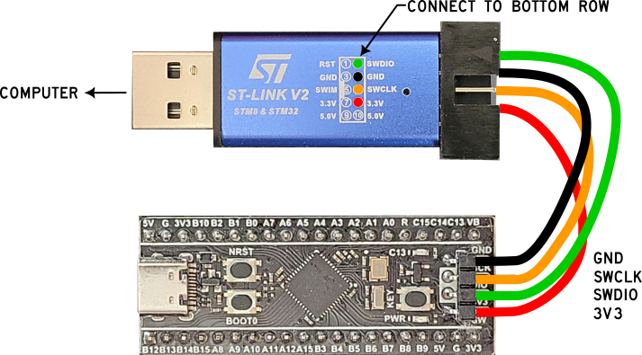

BlackPill Startup
=================

Items needed to get started
---------------------------

The following items are needed to flash Forth onto a new Black Pill:

Don't worry, if you ever want to go back to Arduino just 

.. list-table::
   :widths: 20 40
   :header-rows: 1

   * - Items
     - Description/link
   * - Hardware
     - :doc:`/hardware/microcrontrollers/bluepill/index`
   * - Software
     - :doc:`/programming/forth`
   * - Programmer Software
     - :doc:`/workbench/software/stm32cubeprogrammer`
   * - Programmer Dongle
     - :doc:`/workbench/hardware/stlinkv2`

Things to know
--------------

* This process flashes the Forth binary onto your board. This means that when you hit the reset button or unplug/plug in power, Forth will be there for you. i.e. this process only needs to be done one time.
* You can easily go back to Arduino by flashing any Arduino program to your board if you don't like Forth. In other words, this process does not permanently burn Forth onto your board and you can always re-flash it with another program.
* The ST-LINK dongle is only needed for this process, afterwards communication with your board is through a serial port using a CP2012 dongle.

Wiring
------

**WARNING -- Your STLINK-V2 may have different pinouts. I have multiple dongles and some have the SWDIO, SWCLK, and GND pins in different locations... Check the printing on your dongle, don't blindly use the image below as yours may be slightly different!**

Only four wires are needed to flash Forth onto the black pill *(be sure your pin names are correct)*.

