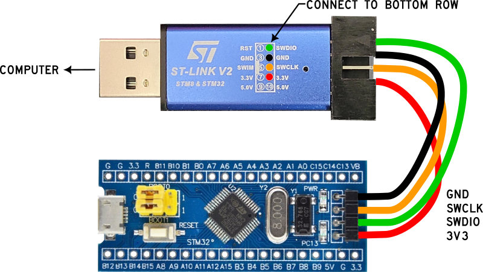
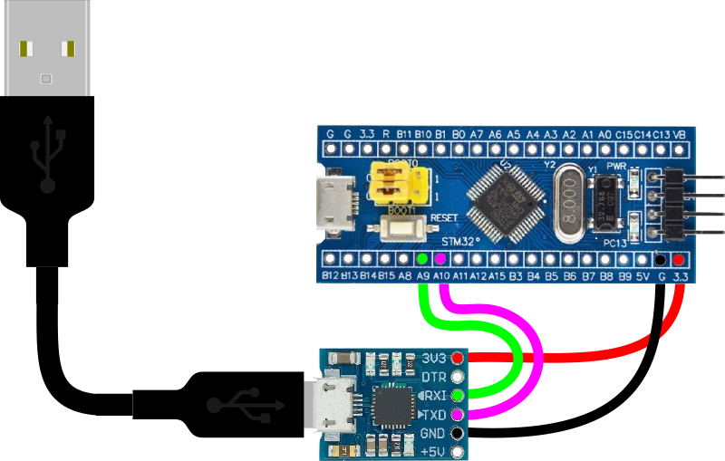

Blue Pill Startup
=================

Items needed to get started
---------------------------

The following items are needed to flash Forth onto a new Blue Pill:

Don't worry, if you ever want to go back to Arduino just 

.. list-table::
   :widths: 20 40
   :header-rows: 1

   * - Items
     - Description/link
   * - Hardware
     - :doc:`/hardware/microcrontrollers/bluepill/index`
   * - Software
     - :doc:`/programming/forth`
   * - Programmer Software
     - :doc:`/workbench/software/stm32cubeprogrammer`
   * - Programmer Dongle
     - :doc:`/workbench/hardware/stlinkv2`

Things to know
--------------

* This process flashes the Forth binary onto your board. This means that when you hit the reset button or unplug/plug in power, Forth will be there for you. i.e. this process only needs to be done one time.
* You can easily go back to Arduino by flashing any Arduino program to your board if you don't like Forth. In other words, this process does not permanently burn Forth onto your board and you can always re-flash it with another program.
* The ST-LINK dongle is only needed for this process, afterwards communication with your board is through a serial port using a CP2012 dongle.

Wire the ST-LINK programmer
---------------------------

**WARNING -- Your STLINK-V2 may have different pinouts. I have multiple dongles and some have the SWDIO, SWCLK, and GND pins in different locations... Check the printing on your dongle, don't blindly use the image below as yours may be slightly different!**

Only four wires are needed to flash Forth onto the blue pill *(be sure your pin names are correct)*.

Flash with the STM32CubeProgrammer
----------------------------------

Either of these two files will work for flashing onto the BluePill

``\mecrisp-stellaris-2.6.5\mecrisp-stellaris-2.6.5\stm32f103\mecrisp-stellaris-stm32f103.bin``

or...

``\mecrisp-stellaris-2.6.5\mecrisp-stellaris-2.6.5\stm32f103\mecrisp-stellaris-stm32f103.hex``

To flash Forth onto the BluePill, follow the instructions for the :doc:`/workbench/software/stm32cubeprogrammer`, then continue below.

Wire the CP2102 USART
---------------------

It doesn't hurt to leave the STLINK wired up to the board, but it's no longer needed.

The Blue Pill uses USART1 wired to the CP2102 which creates a serial connection between the board and your computer.

Setup Serial Console
--------------------

A serial terminal emulator is needed on your computer to communicate with Forth, I use Tera Term. Whichever software you use, a fresh installation of Mecrisp-Stellaris-Forth on a Blue Pill will need VT100 terminal emulation and serial settings of 115200 baud and 8N1 (data/parity/stopbits).

Follow the instructions for :doc:`/workbench/software/teraterm`, then continue below.

