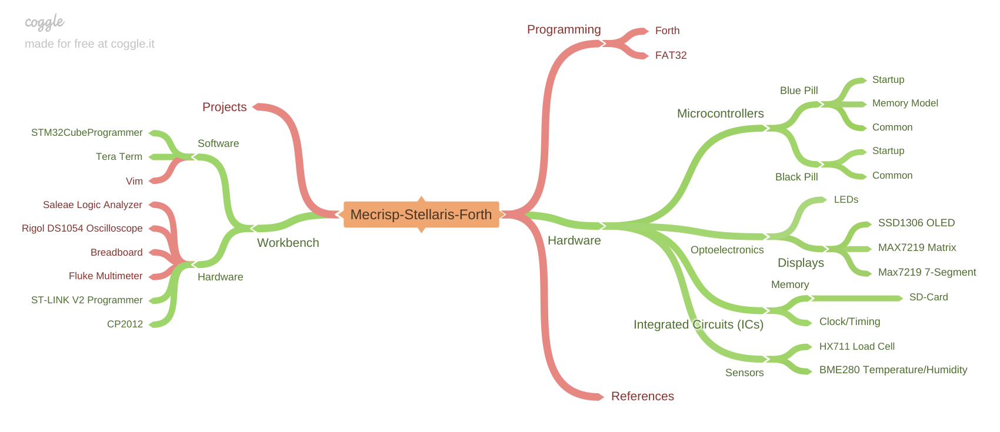

.. this is a comment, it is not rendered
   when adding new *.rst files, reference them here
   in this index.rst for them to be rendered and added to the
   table of contents

Mecrisp-Stellaris-Forth
=======================

**Already have a STM32 Blue Pill board? see** :doc:`/hardware/microcrontrollers/bluepill/bluepillstartup`.

**Already have a STM32 Black Pill board? see** :doc:`/hardware/microcrontrollers/blackpill/blackpillstartup`.

What is Mecrisp-Stellaris-Forth?
--------------------------------

In a nutshell Forth is the best programming language ever, at least for me! In my world, Forth is a very small operating system that gets flashed to my microcrontrollers. During project development I use a Windows serial terminal program like Tera Term to interact directly with the Forth terminal that's running in real-time on the STM32 chip. This is different than typical languages that get written, compiled, and uploaded to the microcrontroller before a program can be run. I think of Forth as a kind of headless computer with a mini dos or unix command shell where I can type in commands to run programs or create new programs without having to compile first.

Forth was writting by `Charles Moore 1970`_, and can be run on Windows, Linux, and many other platforms. Matthias Koch wrote `Mecrisp-Stellaris-Forth`_ as a port of Forth. Mecrisp runs on ARM Cortex M microcrontrollers, which is what this site is primarily dedicated to.

.. _Charles Moore 1970: https://en.wikipedia.org/wiki/Forth_(programming_language)

.. _Mecrisp-Stellaris-Forth: https://sourceforge.net/projects/mecrisp/

Why Learn Forth
---------------

Forth is a breath of fresh air that allows (ahem... maybe forces) me to know how a computer is actually working when executing my programs. I'm the type of person that likes to understand how things work under the hood in order to really grasp concepts. I've done my fair share of Arduino code as well as plain C without Arduino; yes, I know Arduino is just C or C++ wrapped up in an easy to use ide. But, I invariably run into problems during project development where I get stuck trying to do something 'out-of-the-box' but don't understand all of the code being imported behind the scenes or from multiple libraries. Don't get me wrong, Arduino and C are excellent for developing embedded electronics, but I'm very curious and not content with blindly using functions or objects that hide functionality. Yes, I could go read/study those libraries, but there is no substitution for understanding a library when you have to write your own! For simple programs, there is no doubt that using Arduino or the STM32CubeIDE would be quicker for getting a board up and running. But for me, there is immense satisfaction in understanding practically everything happening down to the bit level on my board. 

Ultimately, everthing in life is an abstraction of something more complex. I happen to find Forth is that sweet spot distance of abstraction from the silicon chip, it leaves enough bare that I can see what's happening to provide a better understanding of my programs. Oddly however, Forth can act as a high level laguage like BASIC when desired. In fact, that may be why I like Forth so much. I can bootstrap a new project with very low level bit manipulations to make sure each of my peripherals is operating as intended, then I can easily wrap that complexity into an abstracted high-level language.

Why does this site exist?
-------------------------

I created this site to document all aspects of my journey in applying Mecrisp-Stellaris-Forth to STM32 microcrontrollers. I found that I was creating content too quickly to remember how everything fits together as a whole, and forgetting previous work. This creates ineficiences because I need to re-study things I'd already done. This site is my attempt at organizing my thoughts and code for quick reference as I dig deeper into the world of Forth.

I also want to give back to the Forth community. I'm standing on the shoulders of those giants who have gone before me and have given so much in the way of excellent websites that I've relied on to get me this far. Specifically, I want to give a tremenously loud shout-out to `Terry Porter's website`_ which I've had perpetually open in my browser during my Forth journey.

.. _Terry Porter's website: https://mecrisp-stellaris-folkdoc.sourceforge.io/index.html

..
   raw:: html
   :file: _images/map.html

.. toctree::
   :maxdepth: 4

   hardware/index
   programming/index
   workbench/index

