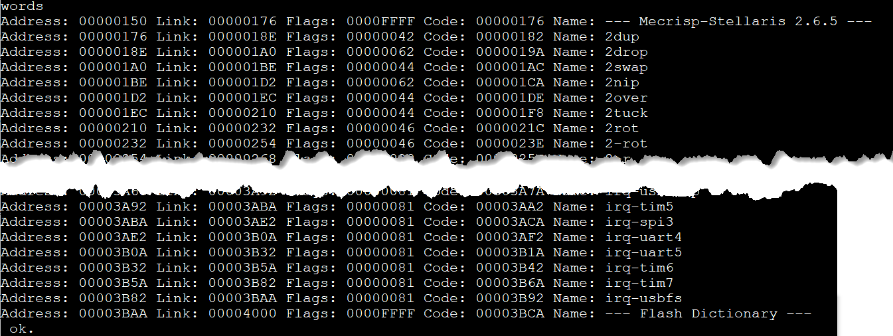

Compiler
========

I was able to compile my own version of mecrisp-stellaris-forth from source code. I used Windows Subsystem for Linux (WSL) installed with the arm compiler and make.

Honestly, it's always felt like black box voodoo and beyond my skills to dabble in the source code and compiling my own version of mecrisp never seemed possible. But, It turned out to be extremely easy to do, and the source files Matthias includes in the forth zip file makes things super simple. The basic steps are:

#. Make a copy of the `common` folder, put it anywhere convenient.
#. Copy the source folder for your specific microcrontroller, keep same relative path to common.
#. Make any edits to the source code.
#. Open a WSL command window and navigate to your source code folder.
#. Run `make` the command line.
#. Done, flash the .bin file to your microcrontroller!

.. note::

    A super easy way to get a WSL terminal opened at the correct path is to use Windows Explorer. Navigate to the copied source code folder for you microcrontroller using Windows Explorer. Then, in the address bar that shows the full path, replace the text with the word `bash` and hit the enter key. Poof! new WSL window at the correct path!

Initial Setup
-------------

If you've never used WSL for Windows. Follow some online instructions and install it.

The GNU Arm Embedded Toolchain is required to compile source code into a .bin file for flashing onto an arm microcrontroller.

I used the following linux commands to install the toolchain:

.. code-block::
    :linenos:

    $ sudo apt-get update
    $ sudo apt remove gcc-arm-none-eabi
    $ sudo apt install gcc-arm-none-eabi

I believe Make comes installed with WSL, otherwise you may need to install it.

----

Changes
-------

Common changes 

Flash Size
**********

After flashing the original .bin file, run the ``words`` command in forth to see a printout of the core dictionary. i.e. A fresh board flashed with mecrisp-stellaris-forth. Notice the dictionary starts at 00000150 ( after the vector table ) and ends at 00003BAA ( which is why 16 kb reserved, i.e. up to 00004000 ).

     *fresh install of original .bin file*

The original source code for the stm32f103 bluepill has 64 kb of memory allocated to flash. 16 kb is reserved for the Mecrisp .bin file. So 64 - 16 = 48 kb remains for flash. The Mecrisp .bin file is written between 0x00000000 and 0x00004000, any code you compile to flash which get added to the dictionary while using the board will start at 0x00004000. 

.. code-block::
    :caption: Constants for flash memory size and distribution ( mecrisp-stellaris-stm32f103.s )
    :emphasize-lines: 5

    @ Konstanten für die Größe und Aufteilung des Flash-Speichers

    .equ Kernschutzadresse,     0x00004000 @ Darunter wird niemals etwas geschrieben ! Mecrisp core never writes flash below this address.
    .equ FlashDictionaryAnfang, 0x00004000 @ 16 kb für den Kern reserviert...           16 kb Flash reserved for core.
    .equ FlashDictionaryEnde,   0x00010000 @ 48 kb Platz für das Flash-Dictionary       48 kb Flash available. Porting: Change this !
    .equ Backlinkgrenze,        RamAnfang  @ Ab dem Ram-Start.

My bluepill boards have the hidden 64 kb of extra flash, so I want to increase the ``FlashDictionaryEnde`` variable by an additional 64 kb. The old value of 0x00010000 becomes 0x0002000

.. code-block::
    :caption: Revised flash memory size code ( mecrisp-stellaris-stm32f103.s )
    :emphasize-lines: 5

    @ Konstanten für die Größe und Aufteilung des Flash-Speichers

    .equ Kernschutzadresse,     0x00004000 @ Darunter wird niemals etwas geschrieben ! Mecrisp core never writes flash below this address.
    .equ FlashDictionaryAnfang, 0x00004000 @ 16 kb für den Kern reserviert...           16 kb Flash reserved for core.
    .equ FlashDictionaryEnde,   0x00020000 @ 112 kb Platz für das Flash-Dictionary     112 kb Flash available. Porting: Change this !
    .equ Backlinkgrenze,        RamAnfang  @ Ab dem Ram-Start.

Greeting
********

To remind myself that I'm working with a modified version of mecrisp, I like to change the greeting on startup.

The original:

.. code-block::
    :caption: Original welcome text ( mecrisp-stellaris-stme32f103.s )

    welcome " for STM32F103 by Matthias Koch"

Changed to:

.. code-block::
    :caption: Modified welcome text ( mecrisp-stellaris-stm32f103.s )

    welcome " for STM32F103 by Matthias Koc, modified by Brett Olson"

