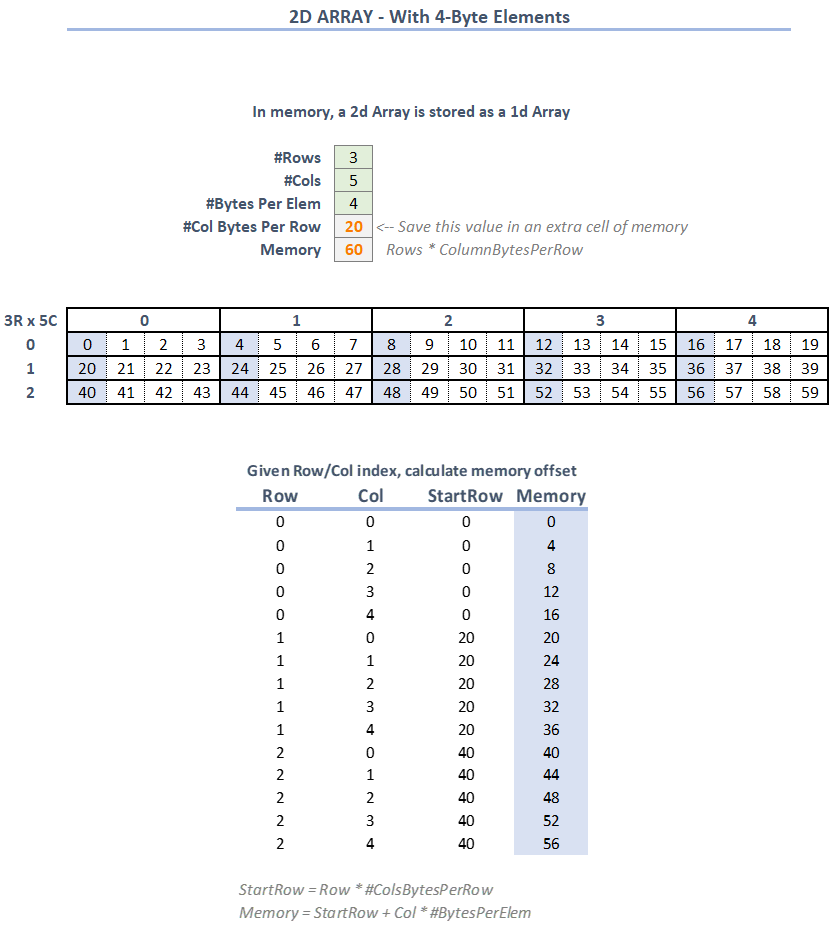

Data Structures
===============

.. toctree::
   :maxdepth: 6 

   self

The goal of this page is to create a library of Data Structures. The words are derived from chapter 11 of a book by James D. Terry found in the Internet Archives called...

.. raw:: html

    <iframe src="https://archive.org/embed/libraryofforthro00terr#page/n266/mode/2up" width="500" height="30" frameborder="0" webkitallowfullscreen="true" mozallowfullscreen="true" allowfullscreen></iframe>

*Ctrl+Click to follow the link to the Internet Archives book, then go to page 266*

.. note:
    The book is based on a 16-bit processor, i.e. a 16-bit word or cell. The code below has been adjusted for a 32-bit processor/word/cell. Also, some of the words used in the book are not used in Mecrisp-Stellaris-Forth so changes have been made accordingly.

Most likely, I wouldn't include this entire library in my common code section because there are so many words with slight variations. Practically, when the need arrises I would just copy/paste the specific word definitions I acutally use into my project code.

----

1ARRAY
******

Create a new defining word that is used to then create multiple one-dimensional arrays of any size. Defining words use ``<BUILDS`` to define built-in code to run when the new variable is created, and ``DOES>`` to define code for a run-time action each time the variable name is executed.

* ``1ARRAY`` should take a number argument representing the number of 32-bit elements ( 4-byte ) blocks of memory to reserve for the array
* The created variables, e.g. ``my1array``,  should take a number argument representing the 0-based index of the memory address returned from executing the variable name

.. code-block::
    :linenos:
    :caption: 1ARRAY forth code

    \ ===================================================================
    \ ONE-DIMENSIONAL ARRAY OF 32-BIT ELEMENTS
    \ -------------------------------------------------------------------
    : 1ARRAY ( BUILDS: N -- ) ( DOES: N -- a-addr )
    <BUILDS
        HERE SWAP cells DUP ALLOT 0 FILL
    DOES>
        SWAP cells +
    ;
    \ Build example  : 10 1ARRAY my1array  \ Creates a 10 element 1-dimensional array of 32-bit values
    \ Does example  1: 765 4 my1array !    \ Stores the value 765 in the 4th element of the my1array array
    \ Does example #2: 4 my1array @ .      \ Puts the value 765 on the stack from the 4th element of the my1array array, and prints it to screen

* ``<BUILDS`` code explained:

  * The number of cells (N) desired should already be on the stack prior to calling ``1ARRAY``

  * ``HERE`` puts the current dictionary memory address on the stack

  * ``SWAP`` moves N to the top of the stack

  * ``CELLS`` calculates byte size of N cells, i.e. N * 4

  * ``DUP`` duplicates the stack value of the number of bytes just calculated

  * ``ALLOT`` advances the dictionary pointer by the number of bytes needed, i.e. it allocates N * 4 bytes to the new variable for storage

  * ``0`` is the value we want to initialize all the storage bytes. The current memory storage has random values leftover

  * ``FILL`` takes three arguments ( c-addr u c ) which are already on the stack from the previous steps. u bytes are written with a value of c starting at c-addr

* ``DOES>`` explained:

  * The index value the ith 0-based array should already be on the stack prior to calling variable name, e.g. ``my1array``

  * By default, when the variable name is executed, the starting address of the array elements is put on the stack

  * ``SWAP`` puts the array index at the top of the stack

  * ``cells`` multiplies the array index by four, which is the offset ( in bytes ) where the ith array element starts in memory

  * ``+`` adds the offset to the starting address of the array elements, which becomes the memory address for the ith array element.

  So, ``1ARRAY`` is similar to normal variables in that a memory address is left on the stack. it's different than normal variables in that it needs an index value ( the ith element ) put on the stack prior to calling the variable name

    *...1ARRAY examples. No value storage here, this is the machine code for creating 1Array variables*

.. code-block::
    :linenos:
    :caption: Test Code

    \ my1array
    10 1array my1array
    dump-word my1array
    765 4 my1array !
    dump-word my1array
    4 my1array @ .

.. figure:: datastruct_my1array.png
    
    *...my1ARRAY examples. Each new variable will have 40-bytes of memory storage ( 32 / 8 * 10 )*

----

1CARRAY
*******

* ``1CARRAY`` should take a number argument representing the number of 8-bit elements ( 1-byte ) blocks of memory to reserve for the array
* The created variables, e.g. ``my1carray``,  should take a number argument representing the 0-based index of the memory address returned from executing the variable name

.. code-block::
    :linenos:
    :caption: 1CARRAY forth code

    \ ===================================================================
    \ ONE-DIMENSIONAL ARRAY OF 8-BIT ( 1-Byte ) ELEMENTS
    \ -------------------------------------------------------------------
    : 1CARRAY ( BUILDS: N -- ) ( DOES: N -- c-addr ) 
    <BUILDS
        HERE SWAP DUP ALLOT 0 FILL
    DOES>
        +
    ;
    \ Build example  : 10 1CARRAY my1carray \ Creates a 10 element 1-dimensional array of 8-bit values
    \ Does example  1: $A5 4 my1carray C!    \ Stores the value 165 in the 4th element of the my1carray array
    \ Does example  2: 4 my1carray C@        \ Puts the value 165 on the stack from the 4th element of the my1carray array
    \ Does example  3: CHAR H 4 my1carray C! \ Stores the value 72 in the 4th element of the my1carray array

* ``<BUILDS`` code explained:

  * The number of bytes (N) desired should already be on the stack prior to calling ``1CARRAY``. *Stack ( N )*

  * ``HERE`` puts the current dictionary memory address on the stack. *Stack ( N c-addr )*

  * ``SWAP`` moves N to the top of the stack. *Stack ( c-addr N )*

  * ``DUP`` duplicates the stack value of the number of bytes. *Stack ( c-addr N N )*

  * ``ALLOT`` advances the dictionary pointer by the number of bytes needed, i.e. it allocates N bytes to the new variable for storage. *Stack ( c-addr N )*

  * ``0`` is the value we want to initialize all the storage bytes. The current memory storage has random values leftover. *Stack ( c-addr N 0 )*

  * ``FILL`` takes three arguments ( c-addr u c ) which are already on the stack from the previous steps. u bytes are written with a value of c starting at c-addr. *Stack ( )*

* ``DOES>`` explained:

  * The index value the ith 0-based array should already be on the stack prior to calling variable name, e.g. ``my1carray``. *Stack ( index )*

  * By default, when the variable name is executed, the starting address of the array elements is put on the stack. *Stack ( index c-addr )*

  * ``+`` adds the offset to the starting address of the array elements, which becomes the memory address for the ith array element. *Stack ( elem-addr )*

  So, ``1CARRAY`` is similar to normal variables in that a memory address is left on the stack. it's different than normal variables in that it needs an index value ( the ith element ) put on the stack prior to calling the variable name

    *...1CARRAY examples. No value storage here, this is the machine code for creating 1CArray variables*

.. code-block::
    :linenos:
    :caption: Test Code

    \ my1carray
    10 1carray my1carray
    dump-word my1carray
    $A5 4 my1carray c!
    dump-word my1carray
    4 my1carray c@
    char H 4 my1carray c!
    dump-word my1carray

    
    *...my1CARRAY examples. Each new variable will have 10-bytes of memory storage*

----

1ARRAY-RNG
**********

* ``1ARRAY-RNG`` should take a number argument representing the number of 8-bit elements ( 1-byte ) blocks of memory to reserve for the array
* The created variables, e.g. ``my1array-rng``,  should take a number argument representing the 0-based index of the memory address returned from executing the variable name

.. code-block::
    :linenos:
    :caption: 1CARRAY forth code

    \ ===================================================================
    \ ONE-DIMENSIONAL ARRAY OF 32-BIT ELEMENTS --> WITH RANGED INDICES
    \ -------------------------------------------------------------------
    : 1ARRAY-RNG ( BUILDS: N1 N2 -- ) ( DOES: N -- a-addr )
    <BUILDS
        SWAP DUP , - 1+
        HERE SWAP CELLS DUP ALLOT 0 FILL
    DOES>
        DUP @ ROT SWAP - CELLS CELL+ +
    ;
    \ Build example  : 1940 1986 1ARRAY-RNG my1array-rng \ Creates a 47 element 1-dimensional array of 32-bit elements with index ranges from 1940 to 1986 inclusive.
    \ Does example   : 105 1940 my1array-rng ! \ Stores the value 105 in the 1st element of the my1array-rng array
    \ Does example   : $DEADBEEF 1985 my1array-rng ! \ Stores the value $DEADBEEF in the second to last element of the my1array-rng array
    \ Does example   : 1985 my1array-rng @ hex. \ Prints the value of the seconde to last element of the my1array-rng array

* ``<BUILDS`` code explained:

  * The lower (N1) and upper (N2) index ranges should already be on the stack prior to calling ``1ARRAY-RNG``. *Stack ( N1 N2 )*

  * ``SWAP`` puts the lower (N1) value at the top of the stack. *Stack ( N2 N1 )*

  * ``DUP`` duplicates the lower (N1) value on the stack. *Stack ( N2 N1 N1 )*

  * ``,`` advances the dictionary pointer by one cell (4-bytes) and fills the cell with the lower (N1) value. This is key, the lower bound value is permanently stored with the variable and will be used later to de-range the indexes back to 0-based. *Stack ( N2 N1 )*

  * ``-`` subtracts ( N2 - N1 ) to determine the number of 32-bit elements to create memory for. *Stack ( rawnumcells )*

  * ``1+`` adds 1 to the number of elements which fixes the 'fence-post' issue of counting. i.e. 5 - 2 = 3, but the intention is to have a memory location for 2,3,4,5 which is 4 elements. *Stack ( numcells )*

  * ``HERE`` puts the current dictionary memory address on the stack. *Stack ( numcells a-addr )*

  * ``SWAP`` moves number of cells to the top of the stack. *Stack ( a-addr numcells )* 

  * ``CELLS`` multiplies numcells by 4 to get number of bytes. *Stack ( a-addr numbytes )* 

  * ``DUP`` duplicates the stack value of the number of bytes. *Stack ( a-addr numbytes numbytes )*

  * ``ALLOT`` advances the dictionary pointer by the number of bytes needed, i.e. it allocates N*4 additional bytes to the new variable for storage. *Stack ( a-addr numbytes )*

  * ``0`` is the value we want to initialize all the storage bytes. The current memory storage has random values leftover. *Stack ( a-addr numbytes 0 )*

  * ``FILL`` takes three arguments ( c-addr u c ) which are already on the stack from the previous steps. u bytes are written with a value of c starting at c-addr. *Stack ()*

* ``DOES>`` explained:

  * The ranged index value should already be on the stack prior to calling variable name, e.g. ``my1array-rng``. *Stack ( rngindex )*

  * By default, when the variable name is executed, the starting address of storage memory is put on the stack, i.e. the address for the lower bound that was stored with the variable. *Stack ( rngindex c-addr )*

  * ``DUP`` duplicates the address of the storage memory. *Stack ( rngindex c-addr c-addr )*

  * ``@`` get 4-byte contents of the storage memory address. i.e. get the lower bound value for this variable. *Stack ( rngindex c-addr lbound )*

  * ``ROT`` brings the requested range index to top of stack. *Stack ( c-addr lbound rngindex )*

  * ``SWAP`` switches the lower bound and requested range on the stack. *Stack ( c-addr rngindex lbound )*

  * ``-`` subtracts ( rngindex - lbound ) which equals the ith element that needs to be revealed. *Stack ( c-addr eleoffset )*

  * ``CELLS`` multiplies element index by 4 to get number of bytes. *Stack ( c-addr eleoffsetbytes )* 

  * ``CELL+`` adds one cell to account for the lower bound cell. *Stack ( c-addr totaloffset )* 

  * ``+`` adds the offset to the starting address of the variable storage memory, which becomes the memory address for the ith array element. *Stack ( ele-addr )*

.. figure:: datastruct_1array-rng.png

    *...1ARRAY-RNG examples. No value storage here, this is the machine code for creating 1Array-rng variables*

.. code-block::
    :linenos:
    :caption: Test Code

    \ my1array-rng
    1940 1986 1array-rng my1array-rng
    dump-word 1array-rng
    105 1940 my1array-rng !
    $DEADBEEF 1985 my1array-rng !
    dump-word my1array-rng
    1985 my1array-rng @ hex.

.. figure:: datastruct_my1array-rng.png
    
    *...my1ARRAY-RNG examples. Each new variable will have 10-bytes of memory storage*

----

2ARRAY
******

Define and allocate space for a two-dimensional cell array.

* ``2ARRAY`` should take a two numbers from the stack representing the number of cells, 32-bit elements ( 4-byte ), for a two dimensional array.
* The created variables, e.g. ``my2array``,  should take two index number arguments representing the 0-based index of each dimension in the array and return the memory address where the 32-bit value is stored

.. figure:: datastruct_2d_GeneralXLS.png

.. code-block::
    :linenos:
    :caption: 2ARRAY forth code

    \ ===================================================================
    \ TWO-DIMENSIONAL ARRAY OF 32-BIT ELEMENTS
    \ -------------------------------------------------------------------
    : 2ARRAY ( BUILDS: N1 N2 -- ) ( DOES: N1 N2 -- a-addr )
    <BUILDS
        DUP CELLS , * 
        HERE SWAP CELLS DUP ALLOT 0 FILL
    DOES>
        DUP @ 3 PICK * ROT CELLS + CELL+ + NIP
    ;
    \ Build example  : 3 5 2ARRAY my2array  \ Creates a 15 element 2-dimensional 0-based array of 32-bit values
    \ Does example : $DEADBEEF 1 2 my2array !    \ Stores the value $DEADBEEF in the 8th element ( skip 5 elems from first row + 3rd elem in 2nd row... there is no need to ever calculate this yourself - only for explanation ).
    \ Does example : 2348 2 4 my2array ! \ Stores the value 2348 ( $92C ) in the last element of the array
    \ Does example : 1 2 my2array @ hex. \ Prints the value of the element from row 1, col 2

* ``<BUILDS`` code explained:

  * The desied number of row cells (N1) and the number of columns cells (N2) should already be on the stack prior to calling ``2ARRAY``. *Stack ( rows cols)*

  * ``DUP`` duplicates the cols value on the stack. *Stack ( rows cols cols )*

  * ``CELLS`` multiplies the number of cols by four to get the number of bytes. Think of this value as the number of memory bytes needed for each row in the 2d array. *Stack ( rows cols colbytes )*

  * ``,`` advances the dictionary pointer by one cell (4-bytes) and writes the number of column bytes per row into the cell. This is a permanent value that will be used in run-time to calculate the memory address of any given row/col. *Stack ( rows cols )*

  * ``*`` multiplies rows by cols to get the total number of cells needed for memory storage. *Stack ( cellcnt )*

  * ``HERE`` puts the current dictionary memory address on the stack. i.e. the beginning of memory where we'll start the array storage. *Stack ( cellcnt a-addr )*

  * ``SWAP`` moves cellcnt to the top of the stack. *Stack ( a-addr cellcnt )*

  * ``CELLS`` calculates byte size of cellcnt, i.e. cellcnt * 4. *Stack ( a-addr arraybytes )*

  * ``DUP`` duplicates the array size value of the number of bytes just calculated. *Stack ( a-addr arraybytes arraybytes )*

  * ``ALLOT`` advances the dictionary pointer by the number of bytes needed, i.e. it allocates rows * cols * 4 bytes to the new variable for storage. *Stack ( a-addr arraybytes )*

  * ``0`` is the value we want to initialize all the storage bytes. The current memory storage has random values leftover. *Stack ( a-addr arraybytes 0 )*

  * ``FILL`` takes three arguments ( c-addr u c ) which are already on the stack from the previous steps. u bytes are written with a value of c starting at c-addr. *Stack ( )*

* ``DOES>`` explained:

  * The 0-based row and col index values should already be on the stack prior to calling variable name, e.g. ``my2array``. *Stack ( row col )*

  * By default, when the variable name is executed, the starting address of the storage area is put on the stack. In our case, this is the beginning address of where we stored the number of column bytes per row. i.e. it's one cell less than where the actual array data is stored. *Stack ( row col a-addr )*

  * ``DUP`` duplicates the starting address on the stack. *Stack ( row col a-addr a-addr )*

  * ``@`` gets the 32-bit value stored at a-addr, which is the number of column bytes per row. *Stack ( row col a-addr colbytes )*

  * ``3 PICK`` copies the row index to the top of the stack, will drop the original later. Normal Mecrisp doesn't have ``ROLL`` unless using the 'RA' core. *Stack ( row col a-addr colbytes row )*

  * ``*`` this is start of the magic that unwraps the 2d indices into a 1d storage. It multiplies the row index by number of column bytes per row. i.e. this is the first offset needed to get the correct memory address for the row/col given. *Stack ( row col a-addr rowoffset )*

  * ``ROT`` puts the col index at the top of the stack. *Stack ( row a-addr rowoffset col )*

  * ``CELLS`` calculates the bytes needed to move this many columns. i.e. col * 4. *Stack ( row a-add rowoffset colbyteoffset )*

  * ``+`` this the second magic that unwraps the 2d indics into a 1d storage. It adds the column index ( in bytes ) to the bulk offset we already calculated for the ith row. *Stack ( row a-addr 1doffset )*

  * ``CELL+`` Because the address we have is not quite at the beginning of the array, add 4-bytes to the offset to account for the original cols per row memory. *Stack ( row a-addr totaloffset )*

  * ``+`` add the total offset to the starting memory address to finally get the memory address of the row/col requested. *Stack ( row ele-addr )* 

  * ``NIP`` delete the original row value. ( ele-addr)*

    *...2ARRAY example. No value storage here, this is the machine code for creating 2Array variables*

.. code-block::
    :linenos:
    :caption: Test Code

    \ my2array
    3 5 2ARRAY my2array
    dump-word my2ARRAY
    $DEADBEEF 1 2 my2array !
    2348 2 4 my2array !
    dump-word my2array
    1 2 my2array @ hex.

    *Test Code results*

