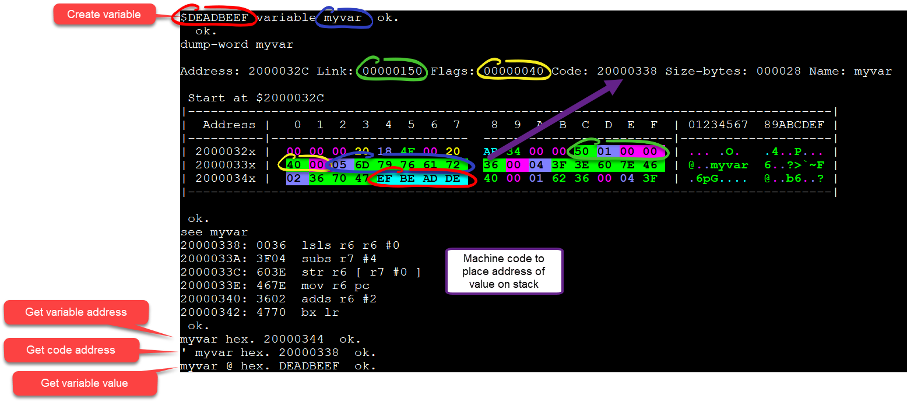
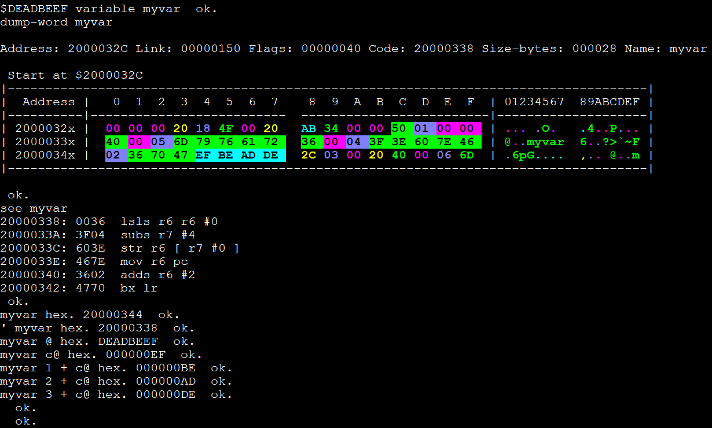
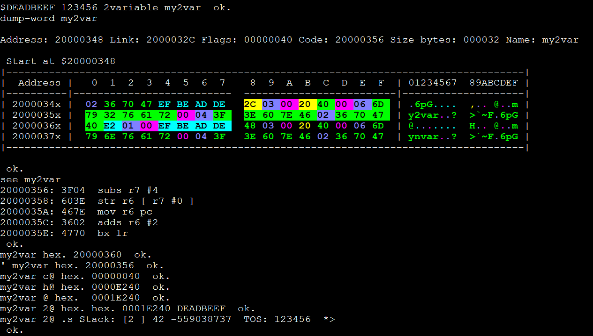
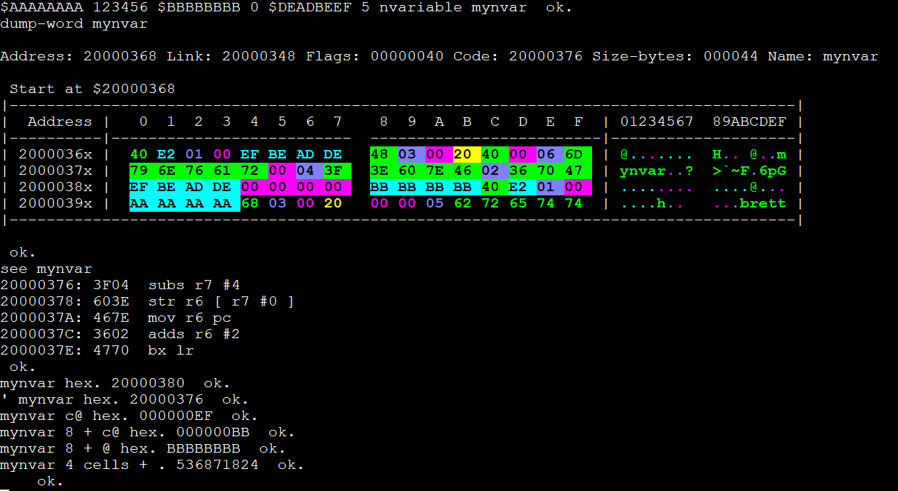

Variables
=========

Creating variables in forth is easy, but the whole story is a bit more complicated. When you create a new variable, multiple separate actions for being performed. A variable is really like a function, when you execute the name of the variable the internal code for the variable will respond by putting the address where the value of the variable is stored on the stack.

1. *Create dictionary word* - A new word is created in the dictionary for the variable using the name you type. Machine code is created that will return the memory address where the value of the variable is stored. 
2. *Add space to store a value* - Depending on the forth word, space may be reserved in the dictionary to accomodate a certain number of bytes to hold the variable value. The address where this value is stored is returned when you type the variable name into the terminal.
3. *Initialize with a given value* - Depending on the forth word, a value may be stored into the space that was created.

----

Anatomy of a variable
---------------------

Below is a screenshot of the variable named ``myvar`` with the value ``$DEADBEEF``. Also shown is a memory dump of the actual variable as it's stored in memory. The memory consists of three main parts:

* *Header* - Contains three sub-parts

  * 4-bytes for a link to the address of the next word in the dictionary. (GREEN)
  * 2-bytes for any flags used by forth. (YELLOW)
  * n-bytes contains two items. 

    * 1-byte holds the number of letters in the name of the word. (first byte of BLUE)
    * n-bytes holds the ascii characters for the variable name. May be padded with an extra byte to keep the code block aligned. (BLUE)

* *Code block* - Contains n-bytes of machine code that get executed when the variable name is used. i.e. The code needed to place the address of the value on the stack
* *Storage block* - Contains n-bytes of memory where the actual value of the variable is stored. (RED)

.. note::
    Notice that a 32-bit value needs 4-bytes of storage, but the variable below requires 28-bytes of memory for the entire variable. Variables are not free, and depending on the length of the name you use, it requires 1-byte of additional memory for each additional character in the name.

After creating the variable, the following words were used to analyze:

``dump-word`` is a custom word I created to print the memory and calcute the number of bytes used in memory.

``see`` comes from the dump.fs file packaged with mecrisp-stellaris-forth zip file. It decompiles the machine code stored in the dictionary and lists the assembly pseudocode as well as the machine code together.

``myvar`` is the typical use for a variable. ``myvar`` executes the code listed above which places the address where the value is stored onto the stack. ``hex.`` is used to print the value of the address to the screen in hexadecimal.

``' myvar`` has lesser use, but returns the address for the executable code location.

``myvar @`` gets the value stored at the address that was placed on the stack. The ``@`` word will return 4-bytes of memory starting at the address on the top of the stack. In this case, we put the address on the stack with ``myvar``.

----

Fetch words
-----------

A quick sidebar on the importantance of recognizing that a variable has no knowledge of it's type, i.e. It doesn't know how much memory is allocated to it. Therefore, you are free to fetch any number of bytes from the address given, even if it doesn't match the number of bytes that were originally used to create the variable. This is a double edged sword, if you use the wrong fetch word, you may get a bad surprise when it doesn't contain what you thought it should; but, this is a great feature for concepts like arrays where you allocated a block of data for the variable with the intention of selectively fetching different bytes like indexing into an array.

Example fetch words:

``c@`` ( c-addr -- char ) - Fetches 1-byte, one value goes on the stack

``h@`` ( c-addr -- char ) - Fetches 2-bytes, one value goes on the stack

``@``  ( a-addr -- u|n ) - Fetches 4-bytes, one value goes on the stack

``2@`` ( a-addr -- ud|d ) - Fetches 8-bytes, two 4-byte values go on the stack

``move`` ( c-addr1 c-addr2 u -- ) - Fetches u number of bytes from c-addr1, but they don't get stored on the stack, they get stored at c-addr2.

----

Variable Words
--------------

These are standard Mecrisp-Stellaris-Forth words:

VARIABLE
********

Creates and seeds a dictionary word with 4-bytes of storage. 

.. code-block::
    :linenos:
    :caption: This forth code...

    \ Example 32-bit variable
    $DEADBEEF variable myvar
    dump-word myvar
    see myvar
    myvar hex.
    ' myvar hex.
    myvar @ hex.
    myvar c@ hex.
    myvar 1 + c@ hex.
    myvar 2 + c@ hex.
    myvar 3 + c@ hex.

.. note::
    Notice how the hex value $DEADBEEF appears in memory as EF-BE-AD-DE. This is due to little-endian format. Forth stores the least significant byte in memory first. The reason it's not stored completely reversed, as in FE-EB-DA-ED, is because the smallest addressable chunk the processor works on is a byte. A byte ( 0-255 ) needs two hex digits ( $0-$FF ), thus individual hex digits are not reversed in a byte. 

    Also, you may observe that the name of the word ``myvar`` is shown in the dump as ``myvar`` and not reversed. Simplified, little-endian applies to multi-byte phrases, like a 32-bit number that needs 4-bytes, but for text the ascii characters are thought of as their own little byte-size number with no connection to the other characters in a string. It's just the way most languages apply little-endian.

     *...Produces this output*

2VARIABLE
*********

.. code-block::
    :linenos:
    :caption: This forth code...

    \ Example 64-bit variable
    $DEADBEEF 123456 2variable my2var
    dump-word my2var
    see my2var
    my2var hex.
    ' my2var hex.
    my2var c@ hex.
    my2var h@ hex.
    my2var @ hex. 
    my2var 2@ hex. hex.
    my2var 2@ .s

.. note::
    The stack only holds 32-bit values. This is the reason two values were entered prior to calling the ``2variable`` word. The same holds true for fetching the value, ``2@`` places two 32-bit values on the stack.

    
    *...Produces this output*

NVARIABLE
*********

Creates and seeds a dictionary word with up to 15 words ( 60-bytes ) of storage.

.. code-block::
    :linenos:
    :caption: This forth code...

    \ Example multi-bit variable
    $AAAAAAAA 123456 $BBBBBBBB 0 $DEADBEEF 5 nvariable mynvar
    dump-word mynvar
    see mynvar
    mynvar hex.
    ' mynvar hex.
    mynvar c@ hex.
    mynvar 8 + c@ hex.
    mynvar 8 + @ hex.
    mynvar 4 cells + .

    
    *...Produces this output*

----

Appending words
---------------

``variable``
************

Creates and seeds a dictionary word with 4-bytes of storage. 
