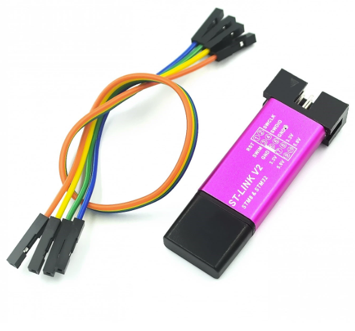

ST-LINK V2 Programming Dongle
=============================

Purpose
-------

Use the ST-Link V2 programmer to flash the binary Mecrisp-Stellaris FORTH operating system onto the STM32 board.

It connects between your Windows computer with usb and the SWD pins on the STM32 board.

What to buy
-----------

These cost about $2 on Aliexpress, `here`_.

.. _here: https://www.aliexpress.us/item/2251832818258311.html?spm=a2g0o.productlist.main.3.75b2763fUtGjbD&algo_pvid=32e25682-c5a2-4003-906b-33de65932595&algo_exp_id=32e25682-c5a2-4003-906b-33de65932595-1&pdp_npi=3%40dis%21USD%211.5%211.42%21%21%21%21%21%40211bf49716840818275762803d07c1%2167118812104%21sea%21US%214319083490&curPageLogUid=KdTlIKsorLJL

