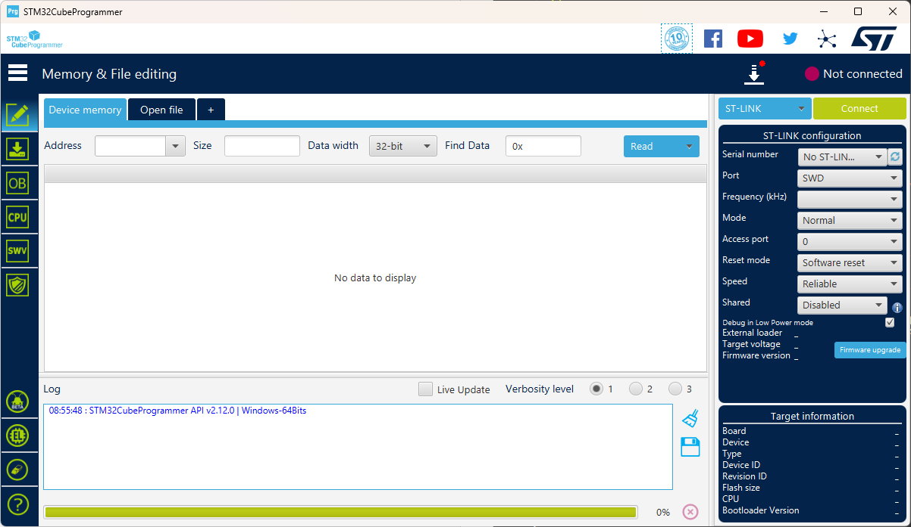
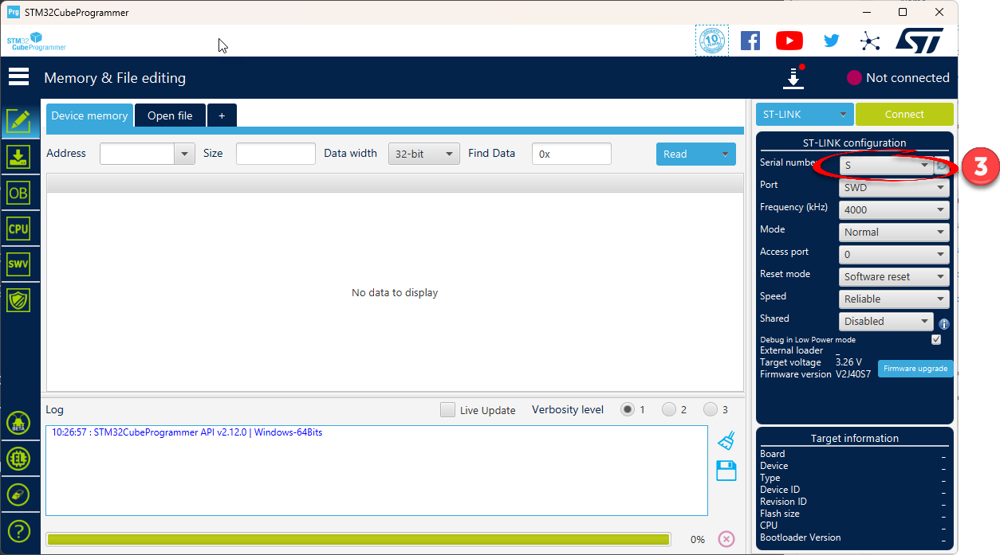
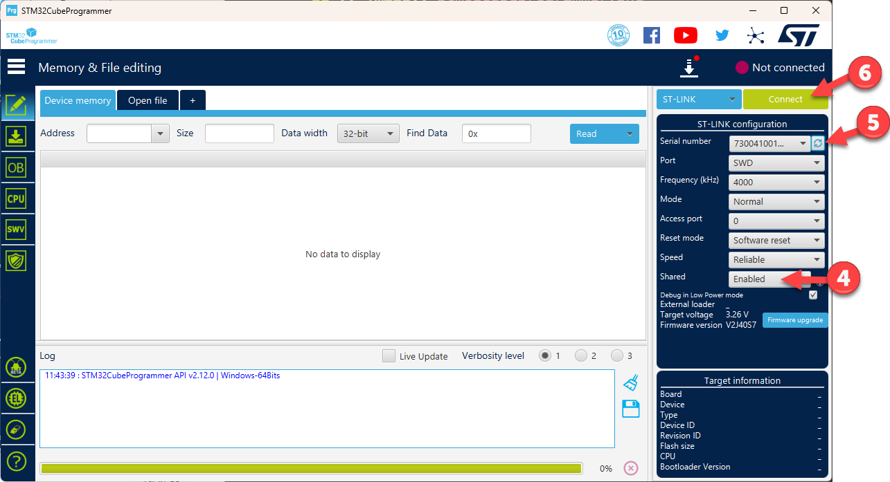
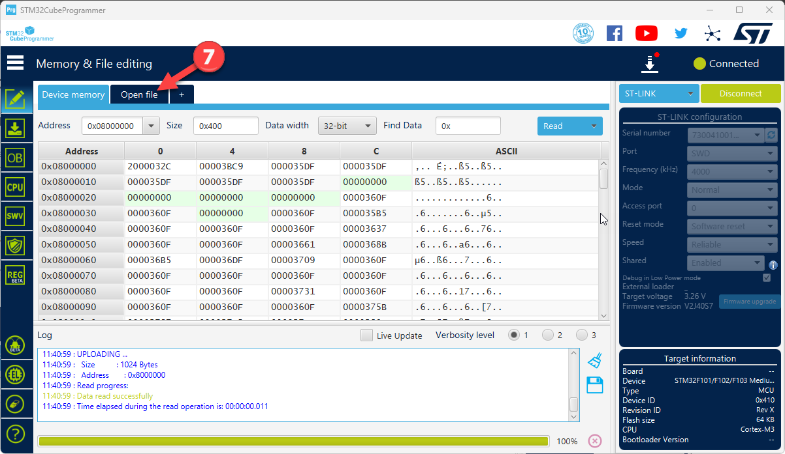
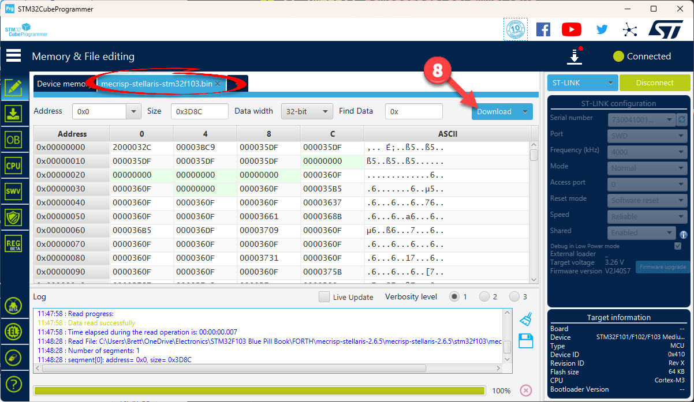
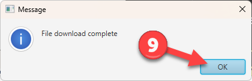
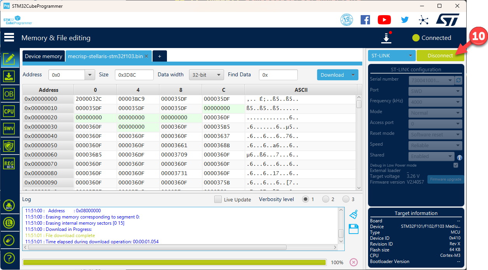

STM32 Cube Programmer
=====================

What's this used for?
---------------------

This is the software application that can flash your STM32 microcrontoller with a new binary file. It communicates through an :doc:`/workbench/hardware/stlinkv2` dongle which is attached between you computers usb and the microcrontrollers SWD pins.

Where to get it?
----------------

The STM32CubeProgrammer is freely downloaded from `STMicroElectronics website`_.
However, you'll need to register for a free account.

.. _STMicroElectronics website: https://www.st.com/en/development-tools/stm32cubeprog.html

Flashing Forth Quicksteps
-------------------------

#. Wire STLINK-V2 to microcrontollers SWD pins.

   a. STM32 Blue Pill wiring
   b. STM32 Black Pill wiring

#. Plug STLINK-V2 into computer.
#. Open STM32CubeProgrammer application. (Should see 'S' for Serial number)
#. Change 'Shared' dropdown to 'Enabled'
#. Click 'refresh' icon next to 'Serial number' dropdown. (Should see number for Serial number)
#. Click green 'Connect' buton in upper right. (Should see Device memory get populated with data)
#. Click the dark-blue 'Open file' tab and locate the correct Forth .bin or .hex file.
#. Click the light-blue 'Download' button to flash the microcrontroller.
#. Click 'OK' on the pop-up 'File download complete' message box.
#. Click the green 'Disconnect' button.
#. Close STM32CubeProgrammer
#. Unplug STLINK-V2. Keep it wired to the board until you're sure Forth is working.

Flashing Forth screenshots
--------------------------

   *Serial number will display an 'S' when opening the program*

   *Changing 'Shared' to 'Enabled' and refreshing displays the serial number. Now click 'Connect'*

   *After pressing 'Connect', device memory should be displayed. Now click 'Open file' and select the forth .bin or .hex file*

   *Click 'Download' to flash the board*

   *Click 'OK' to exit message box*

   *Click 'Disconnect' to finish*

